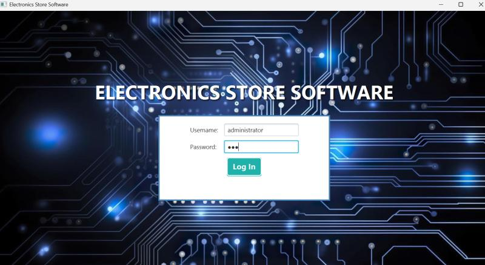
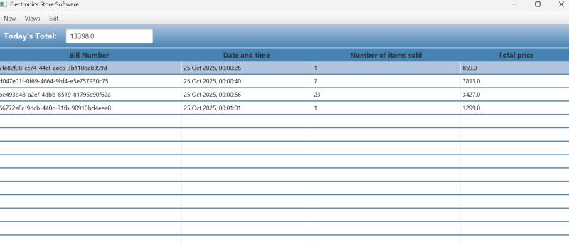
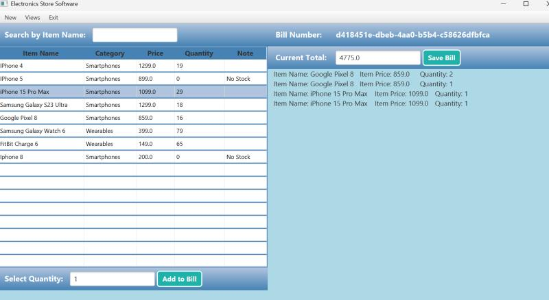
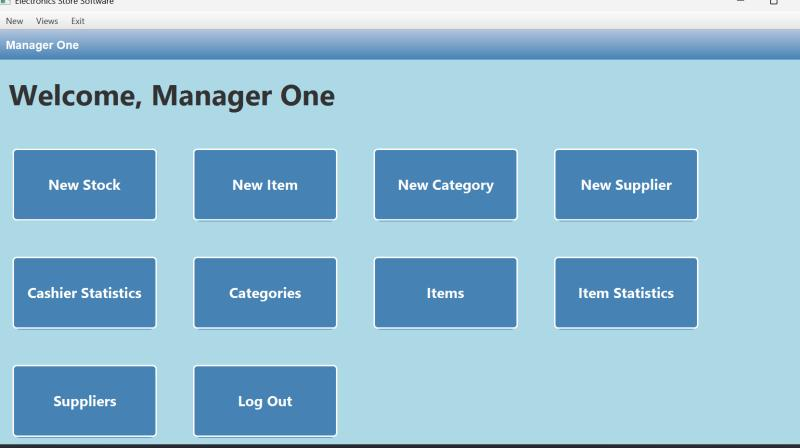
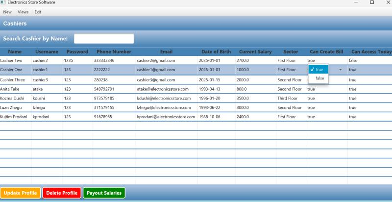

# Electronics-Store

A Java + JavaFX desktop application for managing inventory, sales, and staff roles in an electronics store. Features include bill generation, role-based access (cashier, manager, admin), and sales statistics.

## Features

**Role-based Access**: Three roles (Admin, Manager, Cashier), each with distinct permissions (e.g. only admin can manage users).

**Product / Stock Management**: Add, edit, remove, view product details, update stock, track inventory.

**Billing / Sales**: Create bills for customers, calculate totals, generate receipts.

**Sales Statistics / Reports**: View revenue, best-selling items, sales trends.

**User Management**: Admin can add or delete staff accounts and assign roles.

**Security & Validation**: Input validation to prevent invalid data; restrict access to functions based on role.

## Architecture & Design

This project is built with a modular and object-oriented approach:

**Model-View-Controller (MVC)** / clear separation

## Screenshots

